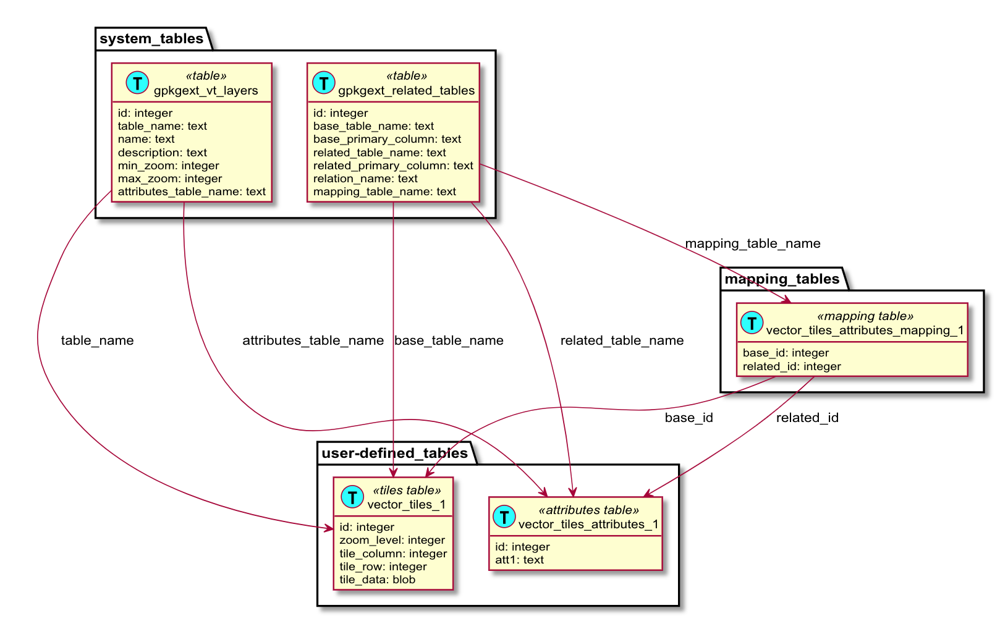

[[VectorTilesAttributesExtensionClause]]
=== Vector Tiles Attributes Extension
This extension defines a relationship between features of a vector tiles layer and vector tiles containing those features.
When this extension is used, it is possible to perform a relational query and isolate only the vector tiles containing relevant features.
In some circumstances this has the potential to greatly improve application performance.

==== Background
The http://docs.opengeospatial.org/is/18-000/18-000.html[GeoPackage Related Tables Extension] (RTE) defines the rules and requirements for creating relationships in a GeoPackage data store between geospatial data tables and other tables that contain or reference related content such as attributes or media. 
As an example, this can be used to establish a many-to-many relationship between features (e.g., points, lines, or areas) and multimedia files. 
By definition, the "left" side of the relationship is the "base" data and the "right" side of the relationship is the "related" data.
The mapping table links related rows in those tables of those types by reference to their primary keys. 

When relating vector tiles with the attributes of the features in those tiles, the base data is the vector tiles and the related data is the attributes as illustrated by <>.
The "GeoPackage Extension for Related Tables" allows a GeoPackage to contain additional data that is related to geospatial (e.g., features) or attributes data.
When relating tiled feature data with attributes, the tiled feature data is the "base" data and the attributes are the "related" data.

.Table Diagram
[#img-model]

[NOTE]
===================
The RTE does not define a requirements class to map tiles tables with attributes tables.
This section defines a requirements class that will fill this need. 
A note has been added to the proposed RTE standard to indicate that additional requirements classes are possible.
For information on using the Related Tables Extension, see the https://github.com/opengeospatial/geopackage-related-tables/wiki/Getting-Started[Getting Started Guide].
===================

==== `gpkg_extensions`
To use this extension, add the following rows to this table as described in http://www.geopackage.org/guidance/getting-started.html#gpkg_extensions[`gpkg_extensions`].

.gpkg_extensions Table Rows
[cols=",,,,",options="header",]
|========================================================================================================================================================================
| table_name | column_name | extension_name | definition | scope
|`gpkgext_relations`|null|`related_tables`|https://github.com/opengeospatial/geopackage-related-tables | `read-write`
|_name of actual <<udmt>>_|null|`related_tables`|https://github.com/opengeospatial/geopackage-related-tables|`read-write`
|========================================================================================================================================================================

[NOTE]
==========
The values in the `definition` column SHOULD refer in some human-readable way to this extension specification. If the extension is adopted by OGC, it will gain the "gpkg_" prefix and get a different definition permalink.
==========

==== `gpkgext_relations`
This table describes extended relationships.
The table requires the following columns:

.gpkgext_relations Table Rows
[cols=",",options="header",]
|========================================================================================================================================================================
| Column        | Description 
| `id`  | primary key 
| `base_table_name` | Name of the vector tiles table
| `base_primary_column` | `id` (all user-defined tiles tables have this column)
| `related_table_name` | Name of the user-defined attributes table
| `related_primary_column` | Name of the primary key column in `related_table_name`
| `relation_name` | `vector_tiles_attributes`
| `mapping_table_name` | Name of a <<udmt>>
|========================================================================================================================================================================

Add a row to this table for each vector tiles layer with attributes in an attributes table.

[[vt-layers]]
==== `gpkgext_vt_layers`
Set the `attributes_table_name` column to the appropriate table for each vector tiles layer with attributes in an attributes table.

[[udmt]]
==== User-defined Mapping Table
A user-defined mapping table describes the many-to-many relationships between base data (tiles) and related data (features).
A user-defined mapping table requires at least the following columns:

.gpkgext_relations Table Rows
[cols=",",options="header",]
|====
| Column        | Description
| `base_id`  | tile ID (the primary key value of the base data table)
| `related_id` | feature ID (the primary key value of the related data table)
|====

[TIP]
====
By adding row to this table for each feature/tile instance, it is possible for a client to query for features by their attributes. 
However, full population of this table is not mandatory.
It may be prudent to omit some entries for space reasons.
====
