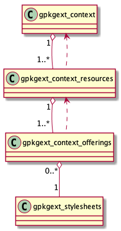

[[owscontext_extension]]
=== GeoPackage OWS Context Extension (Alternate)

[WARNING]
====
This subsection is under discussion and may change radically.
====

==== Extension Title

OWS Context

==== Introduction

This extension provides a mechanism for storing http://owscontext.org[OWS Context] content in a GeoPackage in a relational way. It is aligned with the https://portal.opengeospatial.org/files/?artifact_id=55182[OWS Context Conceptual Model].

==== Extension Author

Image Matters LLC, in collaboration with the participants of the OGC Vector Tiles Pilot and the OWS Context SWG.

==== Extension Name or Template

`im_owscontext` (will become `gpkg_owscontext` if adopted by OGC)

==== Extension Type

New requirement dependent on http://www.geopackage.org/spec/#core[GeoPackage Core (Clause 1)].
It is optionally dependent on the <<styles_extension,Styles Extension>>.

==== Applicability

This extension adds an additional level of organization to existing GeoPackage data.

==== Scope

read-write

==== Specification
The following UML diagram illustrates the relationship between the four OWS Context tables.

[#img_OWS_Context_Model,reftext='{figure-caption} {counter:figure-num}']
.OWS Context Model

===== `gpkg_extensions`

To use this extension, add the following rows to this table as needed.

[[ows_context_ger_table]]
.gpkg_extensions Table Rows
[cols=",,,,",options="header",]
|========================================================================================================================================================================
| table_name | column_name | extension_name | definition | scope
|`gpkgext_contexts` |null |`im_owscontext` |_a reference to this file_ |`read-write`
|`gpkgext_context_resources` |null |`im_owscontext` |_a reference to this file_ |`read-write`
|`gpkgext_context_offerings` |null |`im_owscontext` |_a reference to this file_ |`read-write`
|========================================================================================================================================================================

[NOTE]
==========
The values in the `definition` column SHOULD refer in some human-readable way to this extension specification. If the extension is adopted by OGC, it will gain the "gpkg_" prefix and get a different definition permalink.
==========

[[gpkgext_contexts]]
===== `gpkgext_contexts`
This table describes OWS Context instances. 
The columns of this table are:

* `id` is a primary key
* `title`, `abstract`, `author`, `publisher`, `creator`, `rights`, and `keywords` are text descriptions
* `last_change` is a timestamp in ISO 8601 format
* `min_x`, `min_y`, `max_x`, `max_y`, `srs_id`, `min_time`, and `max_time` are the spatio-temporal extents of the context
* `metadata_id` is a foreign key to `gpkg_metadata` for use with the http://www.geopackage.org/spec121/#extension_metadata[metadata extension].

[[gpkgext_context_resources]]
===== `gpkgext_context_resources`
This table represents an owc:SQLResource, which could be a file, service, or inline content.
The columns of this table are:

* `id` is a primary key
* `context_id` is a foreign key to `id` from `gpkgext_contexts`
* `title`, `abstract`, `author`, `publisher`, `rights`, `description`, and `keywords` are text descriptions
* `min_x`, `min_y`, `max_x`, `max_y`, `srs_id`, `min_time`, and `max_time` are the spatio-temporal extents of the context
* `active` is a boolean flag indicating the state of the resource within the context document
* `min_scale_denominator` and `max_scale_denominator` are the minimum and maximum display scales
* `order` is the ascending order of the resource
* `requestURL` is the service request URL or file URL (`.` for the current file)
* `code` identifies the type of resource (e.g., `GPKG` or `WMS`)

[[gpkgext_context_offerings]]
===== `gpkgext_context_offerings`
This table contains owc:Offering instances which could be a service layer or table.
The columns of this table are:

* `id` is a primary key
* `resource_id` is a foreign key to `id` from `gpkg_context_resources`
* `stylesheet_id` is a foreign key to `id` from `gpkgext_stylesheets` (see <<gpkgext_stylesheets>>)
* `code` is a code identifying the type of offering
* `method` is the name of the operation method request (e.g., `GET`)
* `type` is the media type of the return result
* `layer_name` is a single layer, table, or view name (for tiled feature data, put both the table name and layer name, separated by `/`, for example "tiles_Daraa/AgricultureSrf")
* `query` is an actual SQL or HTTP query
* `contents` is the actual data (for inline data)

[TIP]
====
TODO: Provide some example codes.
====